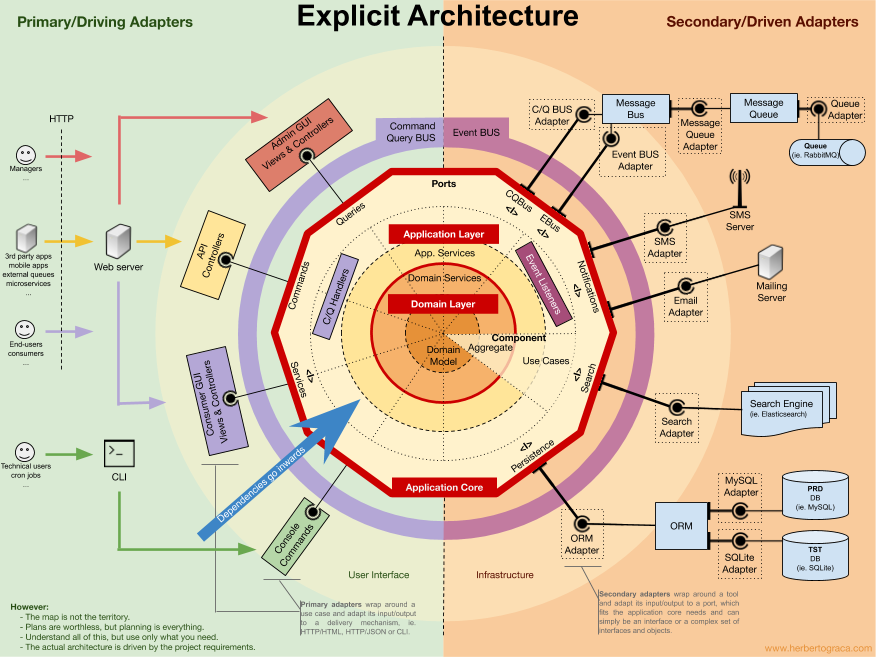

# OnionSeed

| Artifact       | Latest                                                                                                                                                 |
| -------------- | ------------------------------------------------------------------------------------------------------------------------------------------------------ |
| GitHub Release |  |
| OnionSeed      |                                               |

## Summary

This project contains common components, utilities, and scaffolding to enable applications to be created more quickly, following the tenets of SOLID, DDD, and Onion Architecture.

There is a great introductory article to the principles this project is intended to embody, archived [here](./docs/ExplicitArchitecture/Article.md).

View the [Wiki](https://github.com/TaffarelJr/onion-seed/wiki) for documentation about specific APIs included in this project.

## Architectural Decision Records (ADRs)

This repo uses [Architectural Decision Records](https://adr.github.io/)
to guide architectural decision-making during the design process,
as well as document what decisions were made and why (for posterity).
It uses a customized [MADR](https://adr.github.io/madr/) template
to standardize the formatting of these ADRs.
You can find the template and ADR files in the
[docs/decisions](./docs/decisions) directory.

## Monorepo Structure

The repo is structured as a monorepo, with each component in its own directory.
Over time this can make repos become large and unwieldy;
but also makes it much easier to manage dependencies between projects in terms of
development, versioning, publishing, and consumption in other projects.
We feel this is a reasonable trade-off, and can mitigate most of the downsides.

Here's a general overview of the main parts of the repo:

- 📂 [`./`](./) - Contains only a few core files that apply to the entire repo.
  Everything else should be contained in subdirectories
  - 📂 [`docs/`](./docs/) - Contains documentation and diagrams
    describing the architecture and design of OnionSeed
  - 📂 [`src/`](./src/) - Contains all production source code,
    with related components grouped together into additional subdirectories
    where applicable
    - 📦 [`TestUtilities/`](./src/TestUtilities/) - Contains test utilities
    - 📦 [`Utilities/`](./src/Utilities/) - Contains utilities for general use
    - 📄 [`.props`](./.props) - Defines settings that apply to all production projects
  - 📂 [`test/`](./test/) - Contains all test code (in a structure that
    mirrors the [src](./src/) directory above)
    - 📄 [`.editorconfig`](./.editorconfig) - Defines IDE exclusions for test projects
    - 📄 [`.props`](./.props) - Defines settings that apply to all test projects
  - 📄 [`.editorconfig`](./.editorconfig) - Defines IDE settings for the entire repo
  - 📄 [`.props`](./.props) - Defines the basic settings that apply to all projects
  - [ `OnionSeed.sln`](./OnionSeed.sln) -
    Main Visual Studio solution that includes all components

## How to build the code

This is just a standard Visual Studio solution. [OnionSeed.sln](./OnionSeed.sln) is at the root of the repo - simply open it and build.

The unit test project uses multi-targeting to compile against each of the supported platforms; so you'll need to have the SDKs installed for each of them in order to compile fully. Most of them come with Visual Studio; and it should give you error messages explaining which ones you're missing, if any.

## Community

This project is licensed under the standard [MIT license](./LICENSE).

While this is a personal project, I welcome any and all contributions! Review [CONTRIBUTING.md](./CONTRIBUTING.md) and [SECURITY.md](./SECURITY.md) for information about how you can take part.

Please also review the [Code of Conduct](./CODE_OF_CONDUCT.md) before taking an active roll with this project.

Open [SUPPORT.md](./SUPPORT.md) to get information about support, as well as which platforms these components run on.
